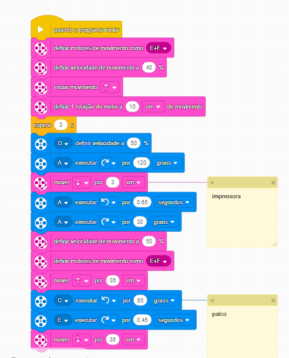

# Primeira progamação
A primeira programação irá fazer a missão da impressora e do palco.
No início da programação podemos ver que o “Vitor” sai da sua área e move-se para frente empurrando a impressora depois move-se para trás puxando a tampa da impressora junto com ele,
após isso o robô vira 0.65cm e vai em direção ao palco concluindo a missão assim retornando para sua base. 
### imagem da progamação 

